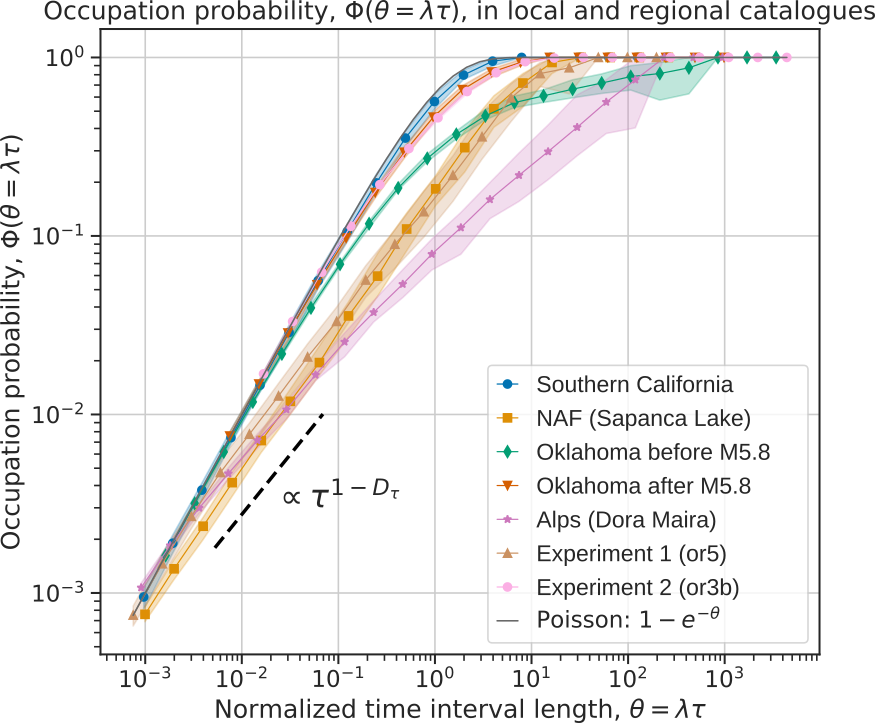

# eqtempclust

Package for the analysis of occupation probability and inter-event times in statistical seismology. 

This package accompanies the following manuscript: 
Eric Beaucé, **Measuring and modeling the occupation probability to characterize the temporal statistics of seismic sequences**, 
*Geophysical Journal International* (DOI coming soon) 

    

